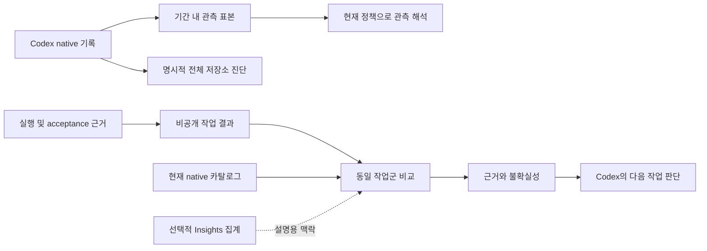

# GroundLine 아키텍처

GroundLine의 책임은 Codex 사용 관측을 실제 작업 결과와 연결하고 비교 가능한 선택을 설명하는 것이다. 실행·모델 선택 적용·권한·작업 관리는 native Codex가 담당한다. GroundLine은 별도 에이전트 실행기나 자동 학습 서비스가 아니다.

| 경계 | 소유 책임 | 하지 않는 일 |
| --- | --- | --- |
| `groundline-contracts` | 구조·수치·소유권 검증, 관측 해석, 결과 비교 | 파일·네트워크·설정 변경 |
| `groundline-runtime` | 제한된 native 입력 읽기, 저장소 진단, 선택적 Insights 연결·수집 | root 모델 자동 변경, 개인 작업 분류 추정 |
| `groundline-cli` | 명령 입출력, 비공개 증거 확인·기록, 명시적 설정 작성과 복구 | background 수집, 기능 사용률 점수, 별도 실험 정책 |
| Insights CLI/API | 동의된 수집·전송·서버 집계·운영 상태 | 대화 원문 업로드, 집계만으로 모델 품질 판정 |
| `xtask` | source/package/설치 artifact 검증과 명시적 배포 도구 | 사용자 작업의 매번 실행 절차 |

## 관측 범위와 품질

`audit weekly`는 native 인덱스가 가리키는 기간 내 표본을 검증한다. 모든 과거 파일을 읽어야 현재 표본을 설명할 수 있는 구조를 제거했다. 선택 표본의 읽기 실패·실행 출처 미분류·중복 식별자는 계속 불완전성으로 표시한다. 전체 모집단 분모는 확인되지 않았으므로 `null`이며 표본 결과를 전체 사용 기록으로 일반화하지 않는다.

`audit store`는 전체 저장소의 파일·DB 불일치를 별도로 진단한다. 진단 결과로 데이터나 동의를 자동 수정하지 않는다. Insights의 동의·전송 상태는 Insights worker가 검증하며 Core가 파일 존재로 다시 추측하지 않는다.

저장 audit 재사용은 입력 관측만 재사용한다. 저비용 추천 계산은 현재 정책으로 다시 수행한다. 원래 기간·hash·현재 이력 미조회 사실을 남기고, 과거 `PASS`를 현재 판단으로 복원하는 경로는 없다.

## 결과 계약

새 `groundline-delivery-manifest`는 schema 2다. 해석은 manifest에 한 번 작성하고 원래 실행·검증 근거의 hash를 확인한다. 같은 필드를 반복하는 별도 관찰 JSON을 요구하지 않는다. 추천 artifact는 schema 2 proposal의 실제 제안과 맞아야 한다. 출력은 private write-once schema 1 receipt이며 경로를 포함하지 않는다.

각 resource entry는 선택적으로 자기 응답의 `effective` model/effort와 근거 hash를 보유한다. child 선택을 root에서 상속하지 않는다. 없는 귀속은 unknown으로 집계하며, 모든 실패·재시도·위임 비용을 한 번씩 센다. hash와 operator 관찰을 provider 인증으로 취급하지 않는다. 자동 native 추출·실제 instruction 활성화·누락 없는 비용 수집이 입증된 것은 아니다.

`efficiency route`의 입력과 proposal은 schema 2다. 기능 사용률 필드는 없으며, 현재 카탈로그와 같은 작업군의 직접 결과를 비교한다. 10건·5%는 명시적 운영 기준이고 통계적 확신은 아니다. 품질·재작업·비용 보호를 유지한다. 집계 보고서가 부족해도 완전한 직접 증거를 별도로 판단한다.

## 폐기와 보존

고정 절감률 `simulate`, Chronicle `fuse`, 작업 단계 `batch`, Core의 중복 integration 상태, 파일 개수 `project-audit`, imported skill registry, 고정 Astra preset을 제거했다. 독립 일반 작업관리 스킬을 줄이고 설치·history 관측·Codex workflow 최적화 세 스킬로 한정했다.

고정 다섯 지침을 만드는 personal의 새 실험·적용·평가 기능은 제거했다. `personal status/rollback`은 기존 상태의 복구 전용이다. 기존 개인 상태·데이터·설정·native 작업은 삭제하지 않는다. 명시적인 현재 데이터 이전과 안전한 복구는 무용한 legacy adapter와 다르다.

공용 계약에 I/O를 추가하거나 새로운 비교 정책·지침 registry·상태 추측 경로를 만들기 전에 기존 소유 경계로 해결할 수 있는지 확인한다. 필요한 보호장치는 유지하며, 검증 상태를 좋게 만들기 위해 unknown을 0이나 success로 바꾸지 않는다.

## 검증

폐기 명령의 명시적 거절, 남은 CLI·설치·복구 경로, 표본/저장소 분리, 중복 소유권·누락·실패 비용, 저장 관측의 재계산을 회귀 테스트한다. source/package 등록부와 실제 CLI help도 맞아야 한다. 소스 테스트 통과는 배포·실사용 품질·토큰 절약의 증명이 아니다.
