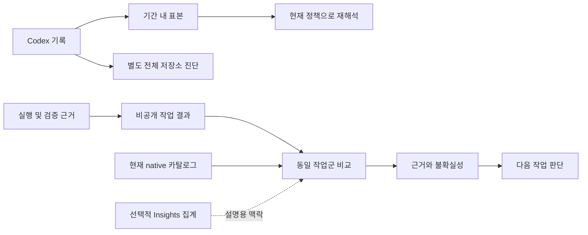

# GroundLine 아키텍처

GroundLine은 사용 패턴·실제 작업 결과·현재 모델의 공식 지침을 연결해
사용 방식과 공통 Codex 환경을 개선하는 것을 목표로 합니다.
실행·모델 적용·권한·에이전트·작업 관리는 Codex가 담당합니다.

아래는 현재 구현 경계입니다. 개인 기준·지속 학습·환경별 적용 영수증의 추가 계약과
구현 순서는 [지속 개선과 환경 통일 설계](adaptive-environment-design.md)에 구분합니다.

| 경계 | 소유 책임 | 제외 |
| --- | --- | --- |
| `groundline-contracts` | 구조·수치·소유권 검증, 관측 해석, 결과 비교 | 파일·네트워크·설정 변경 |
| `groundline-runtime` | 제한된 native 읽기, 저장소 진단, Insights 연결·수집 | root 모델 자동 변경, 개인 작업 분류 추정 |
| `groundline-cli` | 명령 입출력, 비공개 결과 기록, 명시적 설정 변경·복구 | background 수집, 별도 실험 정책 |
| Insights CLI/API | 동의된 전송, 서버 집계, 운영 상태 | 대화 원문 업로드, 집계만으로 품질 판정 |
| `xtask` | 소스·패키지·설치 검증, 명시적 배포 | 사용자 작업마다 강제하는 절차 |

## 유지할 계약

- **관측:** `audit weekly`는 기간 내 인덱스 표본, `audit store`는 전체 저장소 메타데이터 진단입니다. 미확인 모집단 분모는 `null`이며 선택 표본을 전체 이력으로 일반화하지 않습니다. 저장 audit는 관측만 재사용하고 현재 추천을 다시 계산합니다. [감사 계약](../plugins/groundline/references/weekly-usage-audit.md)
- **결과:** 실제 근거의 hash와 명시적 해석을 연결하며 요청·실행·완료를 구분합니다. child 선택을 root에서 상속하지 않고 실패·재시도·위임 비용을 한 번씩 계산합니다. 없는 관측은 unknown, 로컬 hash는 provider 인증이 아닙니다. [결과 계약](../plugins/groundline/references/delivery-evidence.md)
- **비교:** 현재 카탈로그와 같은 작업군의 직접 결과를 비교하며 품질·재작업·자원 보호를 적용합니다. 집계가 불완전해도 직접 증거는 별도로 판단합니다. 운영 임계값은 통계적 확신이나 자동 개선의 증명이 아닙니다. [라우팅 계약](../plugins/groundline/references/evidence-routing.md)
- **상태:** Core는 Insights 동의·전송 상태를 파일 존재로 추측하지 않습니다. 기존 개인 상태는 status/rollback으로만 복구하며 사용자 설정·기록을 삭제하거나 폐기 형식을 자동 변환하지 않습니다. [복구 계약](../plugins/groundline/references/personal-recovery.md)

공용 계약에 I/O를 넣거나 새 실행기·지침 registry·상태 추측 경로를 만들기 전에
기존 소유 경계에서 해결할 수 있는지 확인합니다. 폐기 기능은
[변경 기록](../CHANGELOG.md)에만 기록하며 현재 사용 흐름에 남기지 않습니다.

## 검증

[개발 계약](development.md)은 파싱·파일·설정 보호를,
[행동 검증](guidance-validation.md)은 지침과 실제 결과 비교를,
[릴리스 체크리스트](release-checklist.md)는 패키지·배포·실사용 확인을 담당합니다.
소스 테스트 통과만으로 설치 완료·품질 향상·토큰 절약을 주장하지 않습니다.
