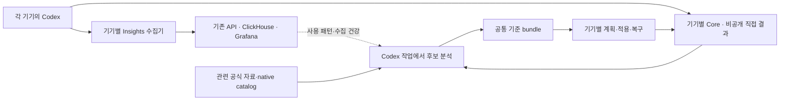

# GroundLine 배포판 최종 설계

확정일: 2026-10-07. 구현 출발점은 2026.1007.2 소스입니다.
이 문서는 2026.1007.3 배포의 범위와 완료 기준이며 구현·설치·공개 배포 완료 보고가 아닙니다.
기능별 사용 위치는 [Codex 기능 조사](codex-native-capabilities.md), 기존 명령과 안전성은
[구현 계약](adaptive-environment-implementation.md), 배포 절차는
[릴리스 체크리스트](release-checklist.md)를 재사용합니다.

## 목적과 고정 원칙

여러 기기의 Codex 사용 패턴과 실제 작업 결과, 현재 모델의 공식 지침을 연결해
사용 방식과 공통 Codex 환경을 개선합니다. 학습 대상은 지침·스킬·작업 방식·환경
기준입니다. 모델 가중치 학습이나 별도 에이전트 실행 서비스를 만들지 않습니다.

Codex의 지원되는 기능을 필요한 작업에 우선 사용합니다. GroundLine은 기기별 관측,
직접 결과와 당시 기준의 연결, 개선 후보·제한 적용·복구·후속 평가를 보완합니다.
품질·완료·재작업을 먼저 보호하고 시간과 전체 비용으로 유용성을 평가합니다.
기능·에이전트·규칙을 많이 사용한 횟수는 성과 지표가 아닙니다.

## 제품과 책임

| 구성 | 책임 | 배포 기준 |
| --- | --- | --- |
| Codex | 설정 해석·모델 적용·실행·위임·권한·기억·스킬·hook trust·작업 관리 | native 기능과 사용자의 명시 선택 유지 |
| Core plugin/CLI | 제한된 native audit, 비공개 결과·학습·환경 관리, 관련 설정 점검 | 기존 세 스킬 재사용, 훅 0개, 상주 실행기 없음 |
| Insights plugin/CLI | 기기별 신규/과거 기록 수집, 제한된 worker, 대기 전송·ACK·재시도 | 선택적 설치와 기존 수집 동의 유지, 필요한 native 훅만 사용 |
| Insights API·ClickHouse·Grafana | 동의된 사용량 집계·기기별 수집 건강·통합 조회 | 기존 중앙 계약과 저장소·대시보드 재사용 |
| xtask·GitHub | 소스·패키지·설치 검증과 버전 배포 | 같은 release commit·version·artifact digest로 추적 |

Core-only, Insights-only, combined 설치를 유지합니다. Core는 Insights가 없어도 직접
capture와 결과 평가를 수행할 수 있고, 자동 경계 관측의 부족은 coverage로 표시합니다.
지원 배포 대상은 Apple Silicon macOS(ARM64)와 Linux(ARM64·x86-64)의 세 조합입니다.

## Codex 기능을 사용하는 위치

| 필요 | 우선 경로 | GroundLine이 보완할 부분 |
| --- | --- | --- |
| 설정·활성 확인 | native config layers, `config/read`, `skills/list`, hook metadata | 공통 기준과 기기 예외의 차이·검증 근거 |
| 지침 재사용·배포 | `AGENTS.md`, skills, plugins/marketplace | 작은 개선 diff, source·개인 기준 revision |
| 독립 작업·검토 | native subagents, worktrees, review, GitHub checks | 직접 결과와 전체 부모/자식 비용의 연결 |
| 장기 실행·연속성 | native 실행 handle·대기·compaction·관련 memory | 중복 실행·읽기 억제, 완료·미완료 근거 |
| 외부·UI·다른 기기 | 직접 API/MCP, Browser/Chrome, Computer Use, native Remote | 실제 대상과 성공 증거·기기별 차이 |
| 기록·자원 | 지원되는 structured interface와 stored-thread 읽기, 필요한 native hooks | 관측 범위 확인, 기존 reader의 부족한 연결 보완 |
| 후속 확인 | 같은 Codex 작업 또는 요청된 native 자동화 | 중복 후보·평가 입력·분석 비용 처리 |

짧고 순차적인 작업은 주 에이전트가 처리합니다. 독립 작업은 전체 조율 비용까지
이득이 있을 때 위임하며 기본 모델·effort를 상속합니다. 명시한 모델 선택을 보존하고
고정 역할별 모델 목록이나 필수 에이전트 수를 배포 지침으로 넣지 않습니다.
스킬은 정확한 발동 조건과 필요한 본문만 사용합니다.
[OpenAI 스킬 문서](https://learn.chatgpt.com/docs/build-skills).

## 기록 수집과 여러 기기

각 기기에 수집기와 별도 identity·cursor·대기 전송 상태를 둡니다. 중앙 서버는 기기별
수집 건강과 통합 사용량을 보여 줍니다. 과거 기록은 해당 기기에서 backfill하고 신규
관측은 같은 durable delivery 경로로 보냅니다. ACK 전에 완료 처리하지 않으며
미처리·오프라인·권한 실패·불완전 관측을 따로 표시합니다.

같은 계정 로그인이나 OTel 설정이 다른 컴퓨터의 과거 기록 접근을 제공한다고 가정하지
않습니다. 필요한 native 구조화 필드와 연결·coverage를 확인한 뒤 그 경로를 우선 사용하고,
부족한 과거 기록·응답 소유권은 기존 제한된 reader로 보완합니다.
OTel 수신기·중복 수집 pipeline의 도입은 이번 배포의 전제에서 제외합니다.
향후 편입 시 OTLP 호환성, 실제 필드, 개인정보 처리와 비용 중복을 검증합니다.
[OpenAI 관측 문서](https://learn.chatgpt.com/docs/config-file/config-advanced#observability-and-telemetry).

App Server의 stored-thread 읽기와 event subscription을 구분합니다. 새 app-server를
시작한 것만으로 기존 App의 모든 이벤트를 읽는다고 주장하지 않습니다. 관측을 위해
사용자의 실제 업무를 resume/start하지 않습니다.
[OpenAI 기록 조회](https://learn.chatgpt.com/docs/app-server#read-a-stored-thread-without-resuming).

현재 중앙 집계와 기기별 직접 결과의 경계를 유지합니다. 대화·prompt·tool output 원문,
비공개 영수증·개인 경로·환경 bundle을 기존 Insights 업로드에 추가하지 않습니다.
각 기기의 직접 결과에서 평가한 교훈을 공통 후보와 기준으로 연결할 수 있지만,
중앙 집계만으로 여러 기기의 업무 품질을 평가하지 않습니다. 중앙 직접 결과 자동
동기화는 이번 배포 범위가 아닙니다.

## 경계·결과·자원 계약

Insights는 기존 SessionStart·Stop·PostCompact·SessionEnd에 UserPromptSubmit을
추가해 최종 5개 관측 훅으로 구성합니다. Core는 0개를 유지합니다.
manifest·trigger·source/upgrade 검사와 릴리스 체크리스트를 같은 변경에서
5개 계약으로 갱신합니다. 바뀐 정의의 trust는 native 인터페이스에서 확인합니다.

UserPromptSubmit은 요청이 실행되기 전 작은 입력 allowlist와 당시 등록 대상의
snapshot을 동기로 저장합니다. 기존 네 훅도 필요한 경계 metadata를 보존합니다.
당시 환경 저장소 identity·bindings·registry와 적용 기록의 digest도 연결합니다. 내용과
공통 기준이 같아도 다른 저장소나 이후 적용 상태의 plan을 이전 경계에 붙이지 않습니다.
전체 payload·prompt 원문을 저장하거나 developer context를 주입하지 않습니다.
분석·네트워크 전송·매번 native CLI 조회는 동기 훅에서 하지 않습니다. 수집 실패는
일반 업무를 막지 않고, 기존 worker가 재처리·누락·상한 도달을 보고합니다.
[OpenAI UserPromptSubmit](https://learn.chatgpt.com/docs/hooks#userpromptsubmit).

trigger별 최신 wake-up 슬롯은 유지하되, 개별 경계 기록을 덮어쓰는 저장소로 쓰지
않습니다. 별도 수신 ID는 재처리 식별자이며 native event ID의 증명이 아닙니다.
thread/turn 대응이 없는 입력, 취소·유실·잘못된 payload는 미연결 상태입니다.
SubagentStart/Stop 훅은 추가하지 않고 확인된 native parent/child 관계를 재사용합니다.
없는 관계를 session_id나 부모 모델로 채우지 않습니다.

| 연결 단위 | 보존할 정보와 판단 |
| --- | --- |
| native 경계 | 기기·runtime·확인된 thread/turn/response 관계, source·관측 시각·누락 범위 |
| 작업 단위 | unit/cohort/phase, 요청에서 명시한 완료 기준과 digest, 포함 경계 refs |
| 당시 환경 | 공통 변경 ref, 기기별 plan/operation, 대상 digest·공식 자료 revision |
| 직접 결과 | receipt digest, 완료·검증·실패·재작업·정정·수락의 직접 근거 또는 unknown |
| 비용 | 관측된 모델·effort, root/child/실패/재시도/자동 리뷰/분석 자원과 미관측 범위 |

한 작업은 여러 턴을 포함할 수 있습니다. 추가 요청으로 완료 기준이 바뀌면 새 기준으로
연결하며, 이를 assistant 오류로 자동 분류하지 않습니다. 기준 선언과 연결은 Codex
작업·기존 helper 안에서 처리하고 사용자에게 별도 JSON·평가 설문을 요구하지 않습니다.
Stop·ACK·assistant 자기 보고·사용자 침묵은 업무 완료나 수락의 증명이 아닙니다.

요청 모델과 실제 관측 모델을 나눕니다. 동일 응답·복사/분기 이력의 소유 범위를
확인하고 token total에 하위 cache/reasoning 항목을 다시 더하지 않습니다.
native notification과 audit를 중복 합산하지 않으며, 식별 범위가 부족하면 비교 불가로
표시합니다. 병렬 child 시간 합계를 전체 완료 시간으로 쓰지 않습니다.

native 발생 시각이 없으면 로컬 수신/관측 시각으로 명시하고, 서로 다른 기기의
wall clock으로 전체 실행 순서를 단정하지 않습니다. 원본 근거의 hash는 내용 식별자이며
provider 인증이나 업무 품질의 증명이 아닙니다. 새 완료 기준·경계가 없는 과거 결과를
현재 환경으로 소급 보충하지 않고, 미지원 상태는 원본을 보존한 채 명시합니다.

## 지속 개선과 환경 통일

개선 순환은 관측 → 후보 → 작은 diff → 범위 내 적용 → 다음 실제 결과 → 평가입니다.
사용자 개선 요청·명시 정정·관련 반복 마찰·의미 있는 공식 변경에서 필요한 근거만
분석합니다. 후보 생성은 native Codex 작업에서 수행하며 상주 LLM을 추가하지 않습니다.
변경 없는 근거와 관련 revision은 재사용하고 실패한 분석은 비용·재시도 상태를 남깁니다.

후속 consumer는 현재 적용과 관련된 직접 결과를 선택해 기존 evaluate에 전달하고,
평가 입력 digest·처리 상태를 기록합니다. 중단 뒤 재개와 중복 소비를 처리하며
조건에 맞는 결과가 없으면 pending, 비교 조건이나 비용이 부족하면 INCONCLUSIVE입니다.
후보 채택·파일 적용·native 발견·실제 실행·효과 확인을 서로 구분합니다.

지속 개선은 명시적으로 활성화한 기기별 private learning profile을 사용합니다.
훅은 해당 profile의 작은 환경 관측과 경계만 기록하며, 수집기 동의와 학습 활성화를
분리합니다. native Codex가 의미 있는 작업의 종류·완료 기준을 선언하고 직접 결과를
제출하면 결과 저장·sidecar 연결·적합한 후속 평가를 함께 처리합니다. 원문을 해석해
성공을 추측하지 않습니다. 이 호출 없이 저장된 경계는 미연결 상태로 표시합니다.

패턴 분석과 후보 작성은 요청된 native Codex 자동화에서 새 근거가 있을 때만
수행할 수 있습니다. 명령형 소비기는 오프라인이며 추가 모델을 실행하지 않습니다.
하루 한 번의 native 후속 확인에서 처리 digest가 같으면 분석을 생략하고, 반복 마찰과
관련 공식 변경만 좁게 검토합니다. 실제 cadence와 활성 상태는 설치 기록에서 확인하며
배포 파일의 존재로 자동화가 작동한다고 주장하지 않습니다.

학습 후보의 시험 적용은 정확한 plan·scope·복구 근거에 연결합니다. hold/reject 이후의
적용과 근거 없는 adoption을 차단하며, INCONCLUSIVE는 성공으로 승격하지 않습니다.
다른 개인 환경 수리와 기존 rollback은 이 후보 gate의 대상이 아닙니다.

공통 기준은 같은 변경 ref와 desired content를 배포합니다. 기기별 경로·예외·native
상태는 local bindings에 남깁니다. 같은 bundle이라도 기기별 plan SHA와 before/after는
다르므로 **공통 변경 ref → 기기별 plan/operation/평가 refs**를 연결합니다.
한 기기의 성공·효과를 다른 기기에 복사하지 않습니다.

등록된 개인 skill 파일과 AGENTS 관리 구간은 기존 CAS·PREPARED·백업·apply·rollback을
사용합니다. 사용자의 후속 편집과 기기 예외를 보존하며 기준·디스크·실제 활성 revision을
나눠 확인합니다. 환경 전달은 기존 private bundle과 승인된 전달 경로를 사용합니다.
설정 계층·native 기억·인증·세션·DB·plugin/provider cache를 통째로 복사하지 않습니다.

공식 자료는 native 도구로 취득한 관련 URL·확인일·text digest와 영향 대상을 연결하고
기존 sources check로 변경을 비교합니다. 문서 변경은 재검토 신호이며 환경 자동 변경
허가가 아닙니다. 새 모델에 이전 모델의 효과를 자동 상속하지 않습니다.

## 권한과 기본 설정

GroundLine 신규 설정 경로의 기본은 workspace-write·on-request·auto_review입니다.
기존 사용자 설정은 보존하고 명시적으로 관리하는 범위에서만 변경합니다.
모델·effort·권한·네트워크는 config와 native 정책에서 관리합니다.

Full Access 선택을 존중하며 GroundLine이 관리하는 추가 제한은 시스템/홈 전체 삭제와
디스크 초기화 등 명백히 치명적인 명령 형태에 좁게 둡니다. 광범위한 Git·인터프리터·
네트워크 명령 금지나 모든 작업에 prompt를 강제하는 규칙은 넣지 않습니다.
지원되는 prefix rule을 App/PATH의 execpolicy check로 실행 없이 검증합니다.
짧은 명령 목록이 모든 script·명령 변형을 막는 완전한 보안 경계라고 주장하지 않습니다.

Auto-review는 승인 요청을 검토하므로 Full Access/never의 모든 작업을 검사하지
않습니다. 기존 기본 reviewer 정책을 유지하고, 실제 마찰이 있는 승인 범위만 native
지원 방식으로 설명합니다. managed 정책·도구/앱 승인·hook trust는 독립적이며
새 관측 훅으로 승인 정책을 재구현하지 않습니다.
[OpenAI Auto-review](https://learn.chatgpt.com/docs/sandboxing/auto-review),
[OpenAI rules](https://learn.chatgpt.com/docs/agent-configuration/rules).

## 이번 배포의 구현 범위

| ID | 필수 보완 | 기존에 재사용할 경로 |
| --- | --- | --- |
| R1 | 작은 동기 경계 기록·UserPromptSubmit·당시 snapshot·미연결/재처리 표시 | checkpoint·worker·등록 대상 관측, 기존 네 훅 |
| R2 | 완료 기준·native 경계·소유 비용과 receipt/sidecar 검증 | native audit projection·capture/prepare/link·delivery |
| R3 | 적합한 후속 결과 선택→evaluate→입력 digest별 처리 | 기존 evaluator·decide/status·분석 중복 억제 |
| R4 | 공통 변경과 기기별 plan/operation/평가 연결·통합 상태 표시 | export/import/plan-bundle·기존 writer·native 관측 |

중앙 전송의 schema 5·contract revision 10은 이번 비공개 연결 확장을 이유로
바꾸지 않습니다. 호환성·기존 집계/report/Grafana를 검증하고, 실제 API 변경이 필요하면
근거와 정확한 범위를 별도로 확정합니다. collector ID·동의·cursor·기존 데이터는 보존합니다.
과거 집계는 사용 패턴 자료로 유지하되 당시 완료 기준·수락·환경 revision을 역추정하지 않습니다.

공개 기본 SKILL 본문·발동 설명과 일반 optimization loop는 현재 공개 2026.1006.1
배포판의 bytes를 유지합니다. 새 CLI·참조문과 기기별 opt-in 절차는 제공하되, 지침을
기본으로 승격하는 비교 시험이나 효과 확인을 이번 기능 설치로 대신하지 않습니다.

새 GUI·기억 서비스·학습 DB·모델 executor·독립 scheduler·전 설정 재작성·모든 훅 활성화는
추가하지 않습니다. 일정이 필요하면 요청된 native 자동화에 연결합니다. CLI/helper는
관측·검증·처리를 수행하고 무변경/근거 부족 상태가 일반 작업을 막지 않게 합니다.

## 배포 완료 기준

| 단계 | 필요한 직접 확인 |
| --- | --- |
| 소스 | 경계 입력·완료 기준 변경·응답 소유·비용 중복·후속 소비·공통/기기별 ref의 회귀와 최종 source qualification |
| 패키지 | Core 0개/Insights 5개 훅 계약, 두 CLI·플러그인의 동일 version, 네 native target·SHA·manifest·source attestation |
| 현재 Mac | App 번들/PATH 각각 native 발견·trust·실제 dispatch, 동시 세션·중단·압축·재개·일반 업무 비차단 |
| 여러 기기 | 별도 실제 지원 기기에서 backfill/오프라인 재전송/중복 retry/ACK와 기기별 중앙 조회, 공통 bundle 적용·native 활성·후속 편집 복구 |
| 서버 | 해당 release의 API image/배포 상태, 계약 readiness, 기존 collector ID·데이터 보존, 실제 ACK→ClickHouse→Grafana 왕복 |
| 행동 | 발동/비발동과 같은 완료 기준의 대표 작업에서 품질·재작업 보호. 변경 지침의 기본 승격은 해당 행동 근거 뒤 수행 |
| 공개 배포 | 새 version tag·검증된 release assets·image digest·stable·설치 fingerprint를 같은 source로 확인 |

이미 통과한 검사는 관련 변경·새 실패·미해결 위험이 있을 때만 반복합니다. 최종 소스의
필수 qualification은 기존 체크리스트에 따라 수행합니다. 품질 향상·토큰 절감 수치는
배포 성공과 분리하며 충분한 직접 비교가 없으면 관측 중으로 보고합니다.

기존 2026.1007.2 검증 기록은 source/package와 후보 설치의 근거입니다. 새 5개 훅·R1~R4,
새 source 설치/서버/다기기 왕복·효과 검증을 대신하지 않습니다.
구현과 qualification 후 새 버전을 정하고 기존 release를 덮어쓰지 않습니다.

이 범위를 다음 구현의 기준으로 고정합니다. 실제 회귀·필수 native interface 변화·사용자
목표 변경이 있을 때 관련 부분만 재검토하며 비교 프로젝트의 새 기능만으로 다시 설계하지 않습니다.
